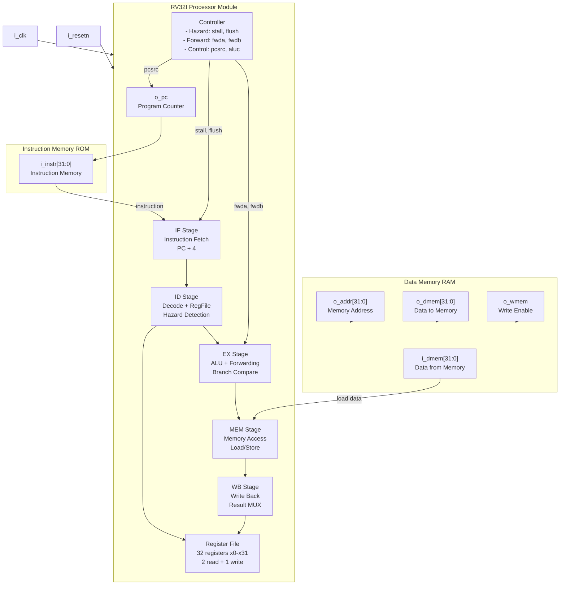
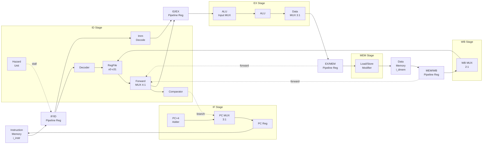
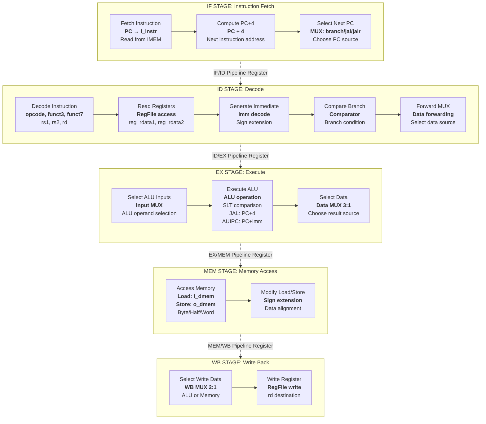
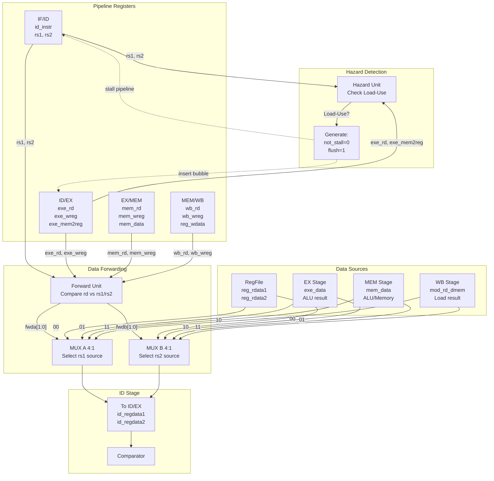

# Pipelined RISC-V Harvard CPU

A 5-stage RV32I processor with Harvard architecture, data forwarding, and hazard control. The pipeline mirrors the standard computer architecture textbook design: IF → ID → EXE → MEM → WB.

---

## Architecture

### High-Level CPU Architecture



The processor separates instruction memory (ROM) and data memory (RAM), allowing simultaneous instruction fetch and data access.


*The waveform shows the PC incrementing by 4 each cycle as instructions flow through the pipeline stages.*

### RISC-V Top-Level Architecture



### Pipeline Stages Detail



### Data Forwarding and Hazard Handling



---

## Repository Layout

```
riscv32-harvard-pipeline/
├── CPU/
│   ├── cpu.v                      # Top-level CPU wrapper
│   ├── Processor/                 # Datapath and control
│   │   ├── RV32I_processor.v     # Pipelined core
│   │   ├── regfile.v             # Register file (x0-x31)
│   │   ├── controller.v          # Hazard and forwarding logic
│   │   ├── ALU/                  # Arithmetic/logic unit
│   │   ├── Comparator/           # Branch comparisons
│   │   └── Pipeline_Registers/   # IF_ID, ID_EXE, EXE_MEM, MEM_WB, pc_reg
│   ├── Instruction_Memory/
│   │   ├── instruction_mem.v     # ROM
│   │   ├── test_program.mem      # Assembled test program
│   │   └── pipelined_cpu_test.asm # Source assembly
│   └── D_memory/
│       └── D_memory.v            # RAM (32 words)
├── Test/
│   ├── cpu_test.sv               # Full CPU testbench
│   └── processor_core_tb.sv      # Core-only testbench
└── Diagrams/                     # Architecture diagrams
```

---

## Design

**Pipeline stages:**
- IF: Instruction fetch from ROM
- ID: Decode and register file read
- EXE: ALU operations and address calculation
- MEM: Data memory access
- WB: Register file write-back

**Hazard handling:**
- Data forwarding from EXE and MEM stages to ALU inputs
- Stall on load-use hazards
- Flush on branches and jumps

**Register file:**
- 32 registers (x0-x31)
- x0 hardwired to zero
- Two read ports, one write port

---

## Running the Test

Prerequisites:
```
choco install icarus-verilog  # Windows
brew install icarus-verilog   # macOS
sudo apt install iverilog     # Linux
```

Run simulation:
```powershell
cd "riscv32-harvard-pipeline"; iverilog -g2012 -s cpu_test -o sim_cpu Test\cpu_test.sv CPU\cpu.v CPU\D_memory\D_memory.v CPU\Instruction_Memory\instruction_mem.v CPU\Processor\RV32I_processor.v CPU\Processor\regfile.v CPU\Processor\controller.v CPU\Processor\mux.v CPU\Processor\imm_decode.v CPU\Processor\load_store_modifier.v CPU\Processor\Pipeline_Registers\if_id_reg.v CPU\Processor\Pipeline_Registers\id_exe_reg.v CPU\Processor\Pipeline_Registers\exe_mem_reg.v CPU\Processor\Pipeline_Registers\mem_wb_reg.v CPU\Processor\Pipeline_Registers\pc_reg.v CPU\Processor\ALU\ALU.v CPU\Processor\ALU\shifter.v CPU\Processor\AddORSub\add_sub.v CPU\Processor\AddORSub\CLA_32.v CPU\Processor\Comparator\comp_32.v; vvp sim_cpu; gtkwave cpu_test.vcd
```

The test program exercises:
- ALU operations (add, sub, shifts, etc.)
- Load/store with different widths
- Branch and jump instructions
- Data forwarding paths
- Load-use hazards

---

## Waveform Viewing

Key signals to inspect:
- `cpu_test.dut.pc` - Program counter (increments by 4)
- `cpu_test.dut.instr` - Fetched instruction
- `cpu_test.dut.processor.register_file.reg_file[*]` - Register contents
- `cpu_test.dut.processor.controller1.o_fwda`, `o_fwdb` - Forwarding controls
- `cpu_test.dut.dmem.ram[*]` - Data memory

Look for:
- Pipeline filling in first few cycles
- PC progression and control flow changes
- Register writes and data forwarding
- Memory operations

---

## Extending

- Replace `test_program.mem` with custom programs
- Increase data memory size
- Add branch prediction
- Synthesize for FPGA and check timing/resources
