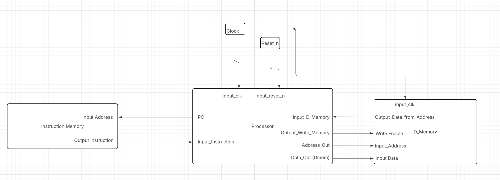
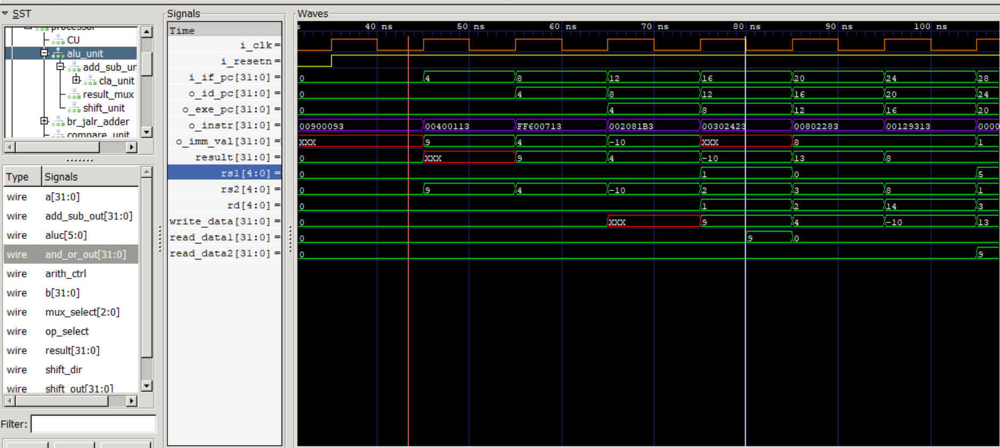
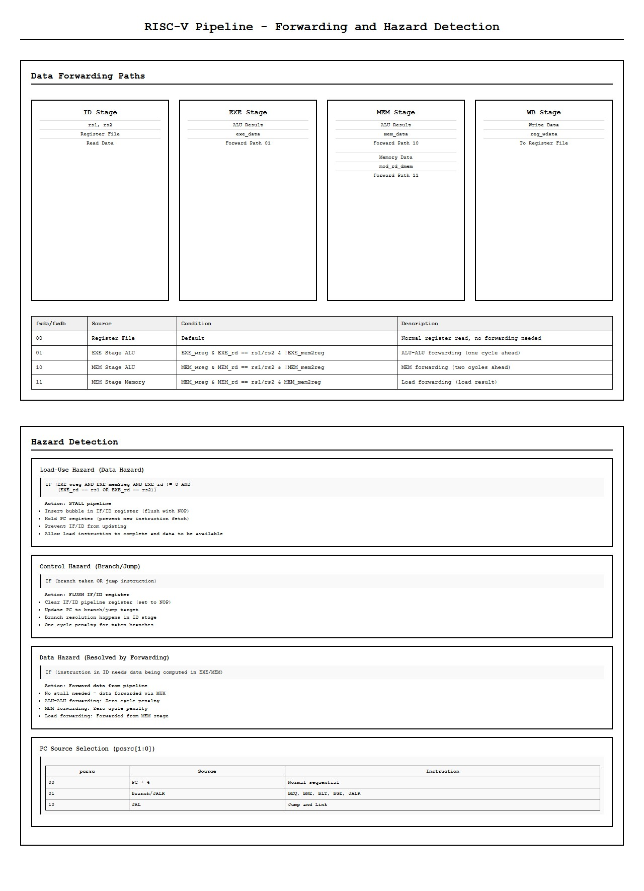

# Pipelined RISC-V Harvard CPU

A 5-stage, Harvard-architecture RV32I processor implemented in SystemVerilog/Verilog.  
The design mirrors the baseline computer-architecture pipeline taught in undergraduate courses: instruction fetch, decode, execute, memory, and write-back stages separated by explicit pipeline registers with forwarding, hazard control, and precise handling of control flow changes.

---

## Architecture Overview

### High-Level CPU Diagram



**What this shows:** The top-level view of the RISC-V CPU showing the separation between Instruction Memory (ROM) and Data Memory (RAM) in the Harvard architecture. The processor core connects to both memories, allowing simultaneous instruction fetch and data access.

### Waveform View



**What this shows:** A GTKwave screenshot demonstrating the CPU in action. Key signals visible:
- **Clock (`i_clk`)**: Regular square wave driving the pipeline
- **Program Counter (`pc`)**: Incrementing by 4 each cycle (0x00, 0x04, 0x08, 0x0C...) as instructions are fetched
- **Instructions (`instr`)**: The 32-bit instruction words being fetched (e.g., `00900093` = ADDI x1, x0, 9)
- **Register file operations**: Register reads/writes and data memory access patterns
- **Pipeline stages**: Instructions flowing through IF → ID → EXE → MEM → WB stages

### Detailed Block Diagrams

For more detailed views of the CPU architecture, see the block diagrams:


**Top-Level Architecture** - Complete CPU with Instruction Memory, Processor Core, and Data Memory


**5-Stage Pipeline** - Detailed view of IF, ID, EXE, MEM, WB stages and their interconnections


**Forwarding & Hazards** - Data forwarding paths and hazard detection logic

---

## Repository Layout

- **`CPU/cpu.v`** — Top-level wrapper that binds the processor core with separate instruction and data memories.  
- **`CPU/Processor/`** — Datapath and control RTL, including ALU, register file, forwarding logic, comparator, and pipeline registers (`IF_ID`, `ID_EXE`, `EXE_MEM`, `MEM_WB`, `pc_reg`).  
- **`CPU/Instruction_Memory/`** — ROM wrapper (`instruction_mem.v`) plus the assembled test image (`test_program.mem`) and the source assembly program (`pipelined_cpu_test.asm`).  
- **`CPU/D_memory/`** — On-chip data memory (`D_memory.v`) with byte-addressable storage mapped to 32 locations.  
- **`Test/`** — Self-checking testbenches. `cpu_test.sv` drives the full CPU and exports a VCD waveform.  
- **`Test/processor_core_tb.sv`** — Tests the pipelined core in isolation, feeding hand-crafted instructions to exercise register forwarding without relying on external memories.  
- **`Diagrams/`** — Architecture diagrams and waveform screenshots

All Verilog files use ASCII encoding; paths above are relative to the repository root.

---

## Micro-Architecture Highlights

- **Classic 5-stage pipeline:**  
  `RV32I_processor.v` decomposes execution into IF → ID → EXE → MEM → WB.  
  Each stage forwards control/data via dedicated pipeline registers that take an `i_clk/i_resetn` and expose stage-specific payloads.

- **Harvard memory system:**  
  Instruction fetches go through `Instruction_Memory`, a simple ROM initialized from `CPU/Instruction_Memory/test_program.mem`.  
  Data reads/writes flow through `Data_Memory`, allowing simultaneous instruction fetch and data access — mirroring the Harvard split discussed in architecture textbooks.

- **Hazard mitigation:**  
  The controller issues forwarding selections (`fwda`, `fwdb`), write enables, and stall/flush signals.  
  Branches and jumps flush the fetch/decode boundary; load-use hazards insert a bubble by holding the PC/IF_ID register.

- **ALU and comparator units:**  
  Arithmetic, logical, and shift operations live under `CPU/Processor/ALU/` and `CPU/Processor/Comparator/`.  
  The ALU supports all RV32I operations, including shifts with immediate and register sources.

- **Register file semantics:**  
  `regfile.v` implements the RV32I architectural register file with two read ports, one write port, and a hard-wired zero register (`x0`).

---

## Test Program

The included test image (`CPU/Instruction_Memory/test_program.mem`) is assembled from `CPU/Instruction_Memory/pipelined_cpu_test.asm`.  

**First 6 instructions:**
1. `ADDI x1, x0, 9` - Load immediate 9 into x1
2. `ADDI x2, x0, 4` - Load immediate 4 into x2
3. `ADDI x14, x0, -10` - Load immediate -10 into x14
4. `ADD x3, x1, x2` - Add x1 + x2, store in x3
5. `SW x3, 8(x4)` - Store x3 to memory address (x4 + 8)
6. `LW x5, 8(x4)` - Load from memory address (x4 + 8) into x5

The program stresses:
- Forwarding paths (ALU-ALU, MEM-WB)
- Control hazards (taken/not-taken branches, JAL, JALR)
- Load/store width modifiers and sign extension
- SLT/SLTU and shift-right arithmetic edge cases

`Data_Memory` is small (32 words), but the program touches the first eight entries to showcase signed/unsigned byte and halfword access.

---

## Quick Start

### Prerequisites

Install Icarus Verilog:
- **Windows (Chocolatey):** `choco install icarus-verilog`
- **macOS (Homebrew):** `brew install icarus-verilog`
- **Ubuntu / Debian:** `sudo apt install iverilog`
- **Fedora / RHEL:** `sudo dnf install iverilog`

Install GTKwave:
- **Windows:** Download from http://gtkwave.sourceforge.net/
- **macOS:** `brew install gtkwave`
- **Ubuntu / Debian:** `sudo apt install gtkwave`
- **Fedora / RHEL:** `sudo dnf install gtkwave`

Verify installation:
```powershell
iverilog -V
vvp -V
gtkwave --version
```

---

## Running Simulations

**IMPORTANT:** Run all commands from the `riscv32-harvard-pipeline/` directory.

### Full CPU Test (CPU + Memories)

This test runs the complete CPU with instruction and data memories:

```powershell
cd riscv32-harvard-pipeline
iverilog -g2012 -s cpu_test -o sim_cpu Test\cpu_test.sv CPU\cpu.v CPU\D_memory\D_memory.v CPU\Instruction_Memory\instruction_mem.v CPU\Processor\RV32I_processor.v CPU\Processor\regfile.v CPU\Processor\controller.v CPU\Processor\mux.v CPU\Processor\imm_decode.v CPU\Processor\load_store_modifier.v CPU\Processor\Pipeline_Registers\if_id_reg.v CPU\Processor\Pipeline_Registers\id_exe_reg.v CPU\Processor\Pipeline_Registers\exe_mem_reg.v CPU\Processor\Pipeline_Registers\mem_wb_reg.v CPU\Processor\Pipeline_Registers\pc_reg.v CPU\Processor\ALU\ALU.v CPU\Processor\ALU\shifter.v CPU\Processor\AddORSub\add_sub.v CPU\Processor\AddORSub\CLA_32.v CPU\Processor\Comparator\comp_32.v
vvp sim_cpu
gtkwave cpu_test.vcd
```

Expected output: The simulation will run and generate `cpu_test.vcd`. GTKwave will open showing waveforms.

### Core-Only Test (No Memories)

Tests the processor core in isolation:

```powershell
cd riscv32-harvard-pipeline
iverilog -g2012 -s processor_core_tb -o core_tb Test\processor_core_tb.sv CPU\Processor\RV32I_processor.v CPU\Processor\regfile.v CPU\Processor\controller.v CPU\Processor\mux.v CPU\Processor\imm_decode.v CPU\Processor\load_store_modifier.v CPU\Processor\Pipeline_Registers\if_id_reg.v CPU\Processor\Pipeline_Registers\id_exe_reg.v CPU\Processor\Pipeline_Registers\exe_mem_reg.v CPU\Processor\Pipeline_Registers\mem_wb_reg.v CPU\Processor\Pipeline_Registers\pc_reg.v CPU\Processor\ALU\ALU.v CPU\Processor\ALU\shifter.v CPU\Processor\AddORSub\add_sub.v CPU\Processor\AddORSub\CLA_32.v CPU\Processor\Comparator\comp_32.v
vvp core_tb
```

**Note:** Add `$dumpfile()` to the testbench if you want VCD output for GTKwave.

### Component Tests

#### ALU Component Test
```powershell
cd riscv32-harvard-pipeline
iverilog -g2012 -o alu_tb Test\ALU_tb.sv CPU\Processor\ALU\ALU.v CPU\Processor\AddORSub\add_sub.v CPU\Processor\AddORSub\CLA_32.v CPU\Processor\ALU\shifter.v CPU\Processor\mux.v
vvp alu_tb
gtkwave ALU_tb.vcd
```

#### Add/Sub Component Test
```powershell
cd riscv32-harvard-pipeline
iverilog -g2012 -o add_sub_tb Test\add_sub32_tb.sv CPU\Processor\AddORSub\add_sub.v CPU\Processor\AddORSub\CLA_32.v
vvp add_sub_tb
```

#### Shifter Component Test
```powershell
cd riscv32-harvard-pipeline
iverilog -g2012 -o shifter_tb Test\shifter_tb.sv CPU\Processor\ALU\shifter.v
vvp shifter_tb
```

#### Comparator Component Test
```powershell
cd riscv32-harvard-pipeline
iverilog -g2012 -o comparator_tb Test\comparator_32bit_test.sv CPU\Processor\Comparator\comp_32.v
vvp comparator_tb
gtkwave comparator_tb.vcd
```

---

## Viewing Waveforms with GTKwave

The `cpu_test.sv` testbench automatically generates `cpu_test.vcd` during simulation. Launch GTKwave with:

```powershell
cd riscv32-harvard-pipeline
gtkwave cpu_test.vcd
```

### Key Signals to Inspect

**Program Counter and Instruction Flow:**
- `cpu_test.dut.pc` - Program counter progression (should increment by 4: 0x0, 0x4, 0x8, 0xC...)
- `cpu_test.dut.instr` - 32-bit instruction words being fetched

**Pipeline Stages:**
- `cpu_test.dut.processor.if_id_reg.*` - IF/ID pipeline register contents
- `cpu_test.dut.processor.id_exe_reg.*` - ID/EXE pipeline register contents
- `cpu_test.dut.processor.exe_mem_reg.*` - EXE/MEM pipeline register contents
- `cpu_test.dut.processor.mem_wb_reg.*` - MEM/WB pipeline register contents

**Register File:**
- `cpu_test.dut.processor.register_file.reg_file[*]` - Register file contents (watch x1, x2, x3, etc. for register writes)
- `cpu_test.dut.processor.register_file.read_data1` - Data read from register port 1
- `cpu_test.dut.processor.register_file.read_data2` - Data read from register port 2

**Control Signals:**
- `cpu_test.dut.processor.controller1.o_fwda`, `o_fwdb` - Forwarding control signals
- `cpu_test.dut.processor.controller1.o_wreg` - Register write enable
- `cpu_test.dut.processor.controller1.o_wmem` - Memory write enable

**Memory:**
- `cpu_test.dut.dmem.ram[*]` - Data memory contents (watch addresses 0-28 for memory writes)

**What to Look For:**
1. **Pipeline filling**: First few cycles show fewer stages active, then all 5 stages become active
2. **PC progression**: Watch the program counter increment, then pause/jump for branches/jumps
3. **Register writes**: When `o_wreg` is high, see which register (`rd`) gets written
4. **Forwarding**: Observe how data from EXE and MEM stages feeds back to ALU inputs
5. **Memory operations**: See store/load instructions accessing data memory

---

## Troubleshooting

- **"No such file or directory"**: Make sure you're in the `riscv32-harvard-pipeline/` directory
- **"Unknown module type" errors**: Missing dependencies - ensure all required `.v` files are included in the iverilog command
- **"gtkwave not found"**: Install GTKwave and ensure it's in your PATH
- **VCD file not generated**: Check that testbench includes `$dumpfile()` and `$dumpvars()`
- **Wrong signal paths**: Use `dut.processor.*` (not `dut.core1.*`) for accessing processor internals

---

## Extending the Design

- Swap `test_program.mem` to validate new instruction mixes or custom benchmarks.  
- Increase `Data_Memory` depth or add memory-mapped I/O for peripherals.  
- Augment the controller with branch prediction or additional forwarding paths to explore advanced architecture topics.  
- Generate synthesis results (Vivado/Quartus) to analyze maximum frequency and resource utilization on FPGA targets.
