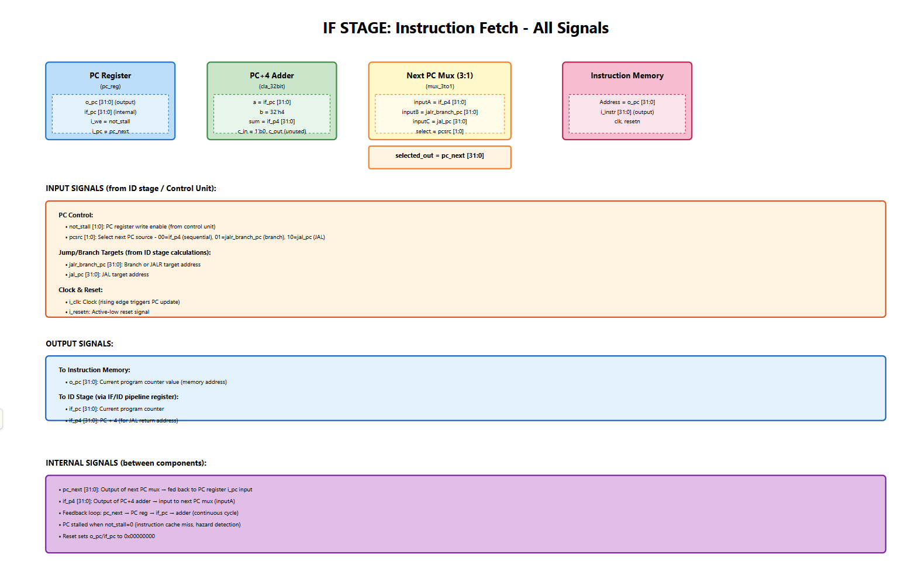
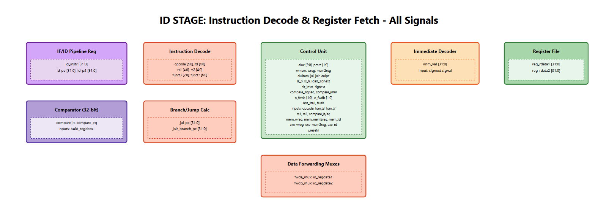
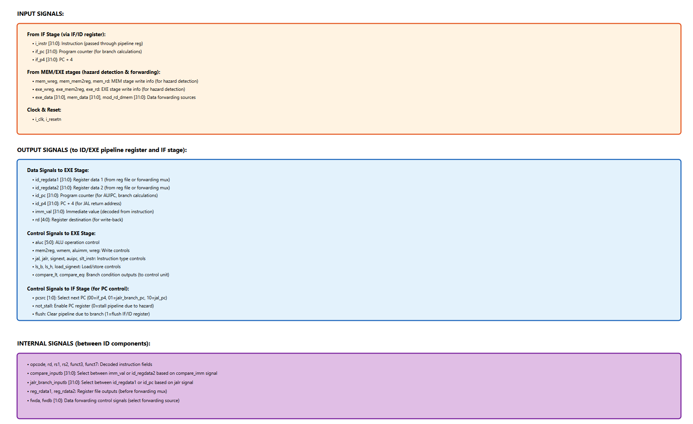
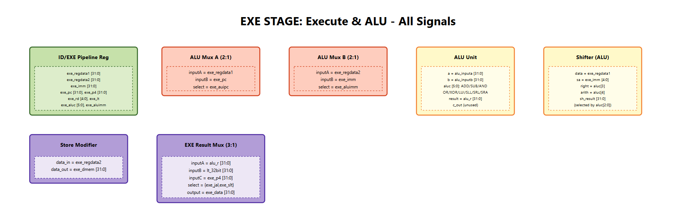
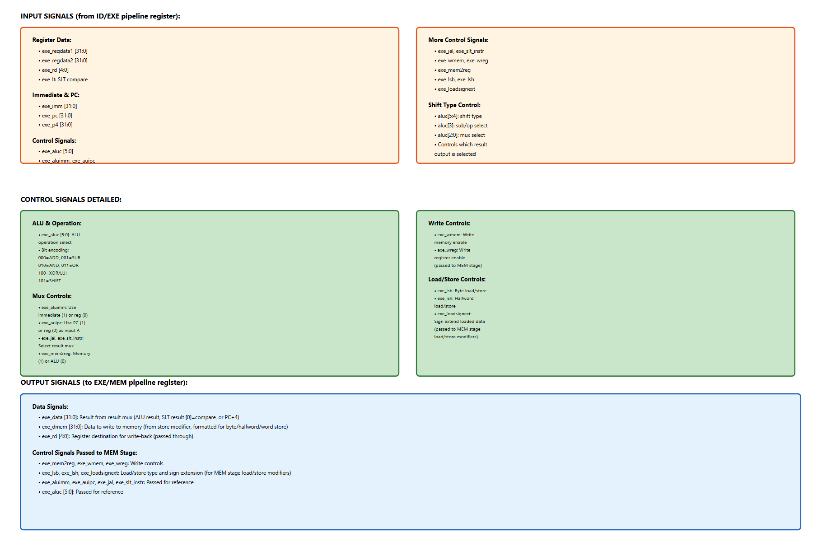
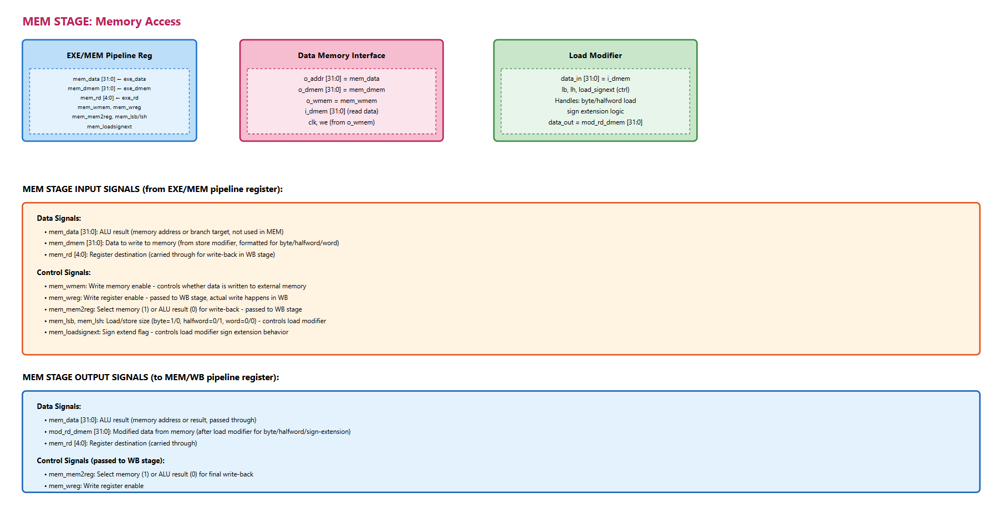
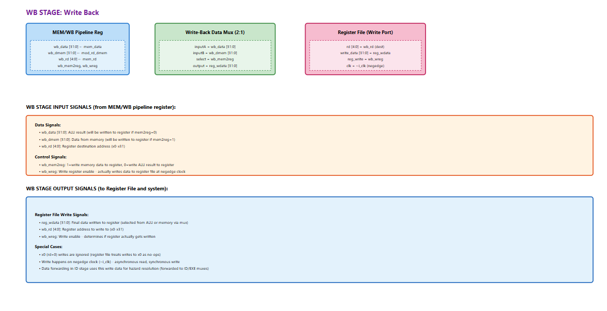

## Pipelined RISC-V Harvard CPU

A 5-stage, Harvard-architecture RV32I processor implemented in SystemVerilog/Verilog.  
The design mirrors the baseline computer-architecture pipeline taught in undergraduate courses: instruction fetch, decode, execute, memory, and write-back stages separated by explicit pipeline registers with forwarding, hazard control, and precise handling of control flow changes.

---

## High Level


## IF


## ID



## EXE



## MEM


## WB



---

### Repository Layout

- **`CPU/cpu.v`** — Top-level wrapper that binds the processor core with separate instruction and data memories.  
- **`CPU/Processor/`** — Datapath and control RTL, including ALU, register file, forwarding logic, comparator, and pipeline registers (`IF_ID`, `ID_EXE`, `EXE_MEM`, `MEM_WB`, `pc_reg`).  
- **`CPU/Instruction_Memory/`** — ROM wrapper (`instruction_mem.v`) plus the assembled test image (`test_program.mem`) and the source assembly program (`pipelined_cpu_test.asm`).  
- **`CPU/D_memory/`** — On-chip data memory (`D_memory.v`) with byte-addressable storage mapped to 32 locations.  
- **`Test/`** — Self-checking testbenches. `cpu_test.sv` drives the full CPU and exports a VCD waveform.  
- **`Test/processor_core_tb.sv`** — Tests the pipelined core in isolation, feeding hand-crafted instructions to exercise register forwarding without relying on external memories.

All Verilog files use ASCII encoding; paths above are relative to the repository root (`riscv-cpu-final`).

---

### Micro-Architecture Highlights

- **Classic 5-stage pipeline:**  
  `RV32I_processor.v` decomposes execution into IF → ID → EXE → MEM → WB.  
  Each stage forwards control/data via dedicated pipeline registers that take an `i_clk/i_resetn` and expose stage-specific payloads.

- **Harvard memory system:**  
  Instruction fetches go through `Instruction_Memory`, a simple ROM initialized from `CPU/Instruction_Memory/test_program.mem`.  
  Data reads/writes flow through `Data_Memory`, allowing simultaneous instruction fetch and data access — mirroring the Harvard split discussed in architecture textbooks.

- **Hazard mitigation:**  
  The controller issues forwarding selections (`fwda`, `fwdb`), write enables, and stall/flush signals.  
  Branches and jumps flush the fetch/decode boundary; load-use hazards insert a bubble by holding the PC/IF_ID register.

- **ALU and comparator units:**  
  Arithmetic, logical, and shift operations live under `CPU/Processor/ALU/` and `CPU/Processor/Comparator/`.  
  The ALU supports all RV32I operations, including shifts with immediate and register sources.

- **Register file semantics:**  
  `regfile.v` implements the RV32I architectural register file with two read ports, one write port, and a hard-wired zero register (`x0`).

---

### Test Program

The included test image (`CPU/Instruction_Memory/test_program.mem`) is assembled from `CPU/Instruction_Memory/pipelined_cpu_test.asm`.  
It stresses:

- Forwarding paths (ALU-ALU, MEM-WB)
- Control hazards (taken/not-taken branches, JAL, JALR)
- Load/store width modifiers and sign extension
- SLT/SLTU and shift-right arithmetic edge cases

`Data_Memory` is small (32 words), but the program touches the first eight entries to showcase signed/unsigned byte and halfword access.

---

### Running the Simulation

Detailed build/run commands for the full CPU test, the core-only regression, and the standalone component benches are collected in `SIMULATION.md`.  
That guide also captures Icarus Verilog installation tips and the expected output artifacts for each run.

---

### Waveform

`Test/cpu_test.sv` emits `cpu_test.vcd` during each run; suggested traces to inspect:

- `cpu_test.dut.pc`: program counter progression through the pipeline.  
- `cpu_test.dut.core1.register_file.reg_file[*]`: register file writes (watch x11/x13 for the final PASS message).  
- `cpu_test.dut.core1.id_exe_reg` / `exe_mem_reg`: confirm operand forwarding and pipeline timing.  
- `cpu_test.dut.dmem.ram`: memory writes at addresses 0–5 showing byte/halfword behavior.

GTKWave launch commands for this and the other component benches are listed in `SIMULATION.md`.

---

### Extending the Design

- Swap `test_program.mem` to validate new instruction mixes or custom benchmarks.  
- Increase `Data_Memory` depth or add memory-mapped I/O for peripherals.  
- Augment the controller with branch prediction or additional forwarding paths to explore advanced architecture topics.  
- Generate synthesis results (Vivado/Quartus) to analyze maximum frequency and resource utilization on FPGA targets such as the KC705 board referenced in the project path.

This README reflects the current directory names and simulation flow in the repo.  
Update the command snippets if files are reorganized.

---

## Simulation Quick Reference

### Install Icarus Verilog

- **Windows (Chocolatey):** `choco install icarus-verilog`
- **macOS (Homebrew):** `brew install icarus-verilog`
- **Ubuntu / Debian:** `sudo apt install iverilog`
- **Fedora / RHEL:** `sudo dnf install iverilog`

Verify with `iverilog -V` and `vvp -V`.

---

### Icarus Verilog Runs

All commands assume you are in the repository root (`riscv-cpu-final`).

#### Full CPU + Memories

```powershell
iverilog -g2012 -s cpu_test -o sim_cpu `
  Test\cpu_test.sv `
  CPU\cpu.v `
  CPU\D_memory\D_memory.v `
  CPU\Instruction_Memory\instruction_mem.v `
  CPU\Processor\RV32I_processor.v `
  CPU\Processor\regfile.v `
  CPU\Processor\controller.v `
  CPU\Processor\mux.v `
  CPU\Processor\imm_decode.v `
  CPU\Processor\load_store_modifier.v `
  CPU\Processor\Pipeline_Registers\if_id_reg.v `
  CPU\Processor\Pipeline_Registers\id_exe_reg.v `
  CPU\Processor\Pipeline_Registers\exe_mem_reg.v `
  CPU\Processor\Pipeline_Registers\mem_wb_reg.v `
  CPU\Processor\Pipeline_Registers\pc_reg.v `
  CPU\Processor\ALU\ALU.v `
  CPU\Processor\ALU\shifter.v `
  CPU\Processor\AddORSub\add_sub.v `
  CPU\Processor\AddORSub\CLA_32.v `
  CPU\Processor\Comparator\comp_32.v
vvp sim_cpu
```

#### Core-Only Register Test (no memories)

```
iverilog -g2012 -s processor_core_tb -o core_tb `
  Test\processor_core_tb.sv `
  CPU\Processor\RV32I_processor.v `
  CPU\Processor\regfile.v `
  CPU\Processor\controller.v `
  CPU\Processor\mux.v `
  CPU\Processor\imm_decode.v `
  CPU\Processor\load_store_modifier.v `
  CPU\Processor\Pipeline_Registers\if_id_reg.v `
  CPU\Processor\Pipeline_Registers\id_exe_reg.v `
  CPU\Processor\Pipeline_Registers\exe_mem_reg.v `
  CPU\Processor\Pipeline_Registers\mem_wb_reg.v `
  CPU\Processor\Pipeline_Registers\pc_reg.v `
  CPU\Processor\ALU\ALU.v `
  CPU\Processor\ALU\shifter.v `
  CPU\Processor\AddORSub\add_sub.v `
  CPU\Processor\AddORSub\CLA_32.v `
  CPU\Processor\Comparator\comp_32.v
vvp core_tb
```

#### Component Benches
```
iverilog -g2012 -o alu_tb Test\ALU_tb.sv CPU\Processor\ALU\ALU.v
vvp alu_tb

iverilog -g2012 -o add_sub_tb Test\add_sub32_tb.sv CPU\Processor\AddORSub\add_sub.v
vvp add_sub_tb

iverilog -g2012 -o comparator_tb Test\comparator_32bit_test.sv CPU\Processor\Comparator\comp_32.v
vvp comparator_tb

iverilog -g2012 -o shifter_tb Test\shifter_tb.sv CPU\Processor\ALU\shifter.v
vvp shifter_tb
```


#### GTKWave
```
CPU regression: gtkwave cpu_test.vcd

Core bench: (no VCD by default; add $dumpfile if needed)

ALU: gtkwave ALU_tb.vcd

Comparator: gtkwave comparator_tb.vcd
```